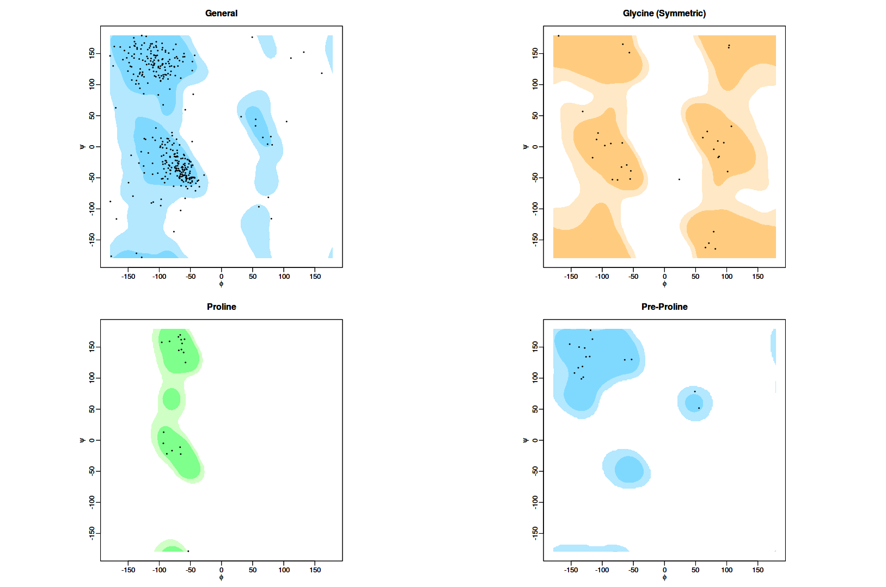
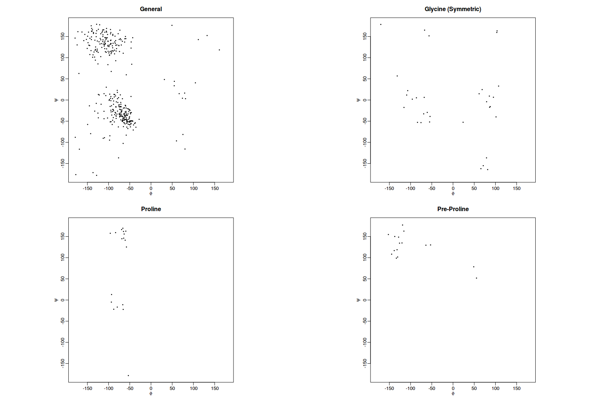
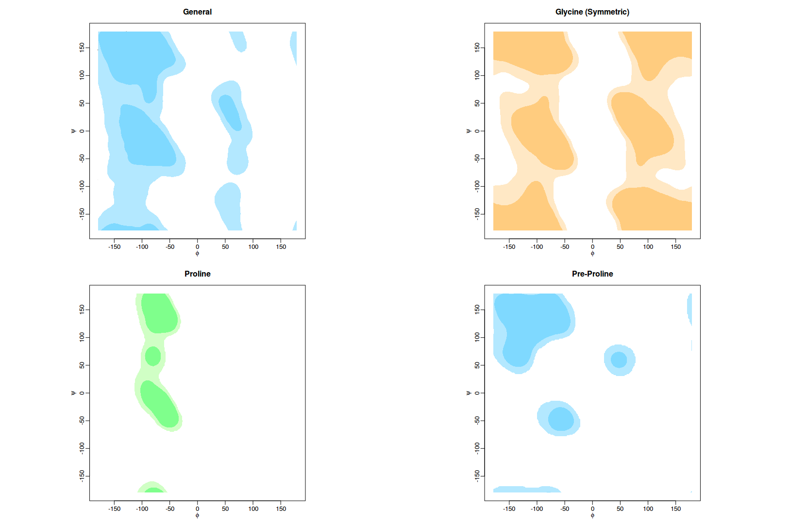

## Ramachandran-Plot

R code for creating Ramachandran Plot with Example. (Python Code underway)
This is generated by the superimposition of Scatter Plot on the Contour Plot

## Scatter Plot 

This has been created from input data given in the form of a .tsv file 

## Contour Plot 

This has been created from from database of 500 high definition protein structures { Lovell et al 2003 }.

